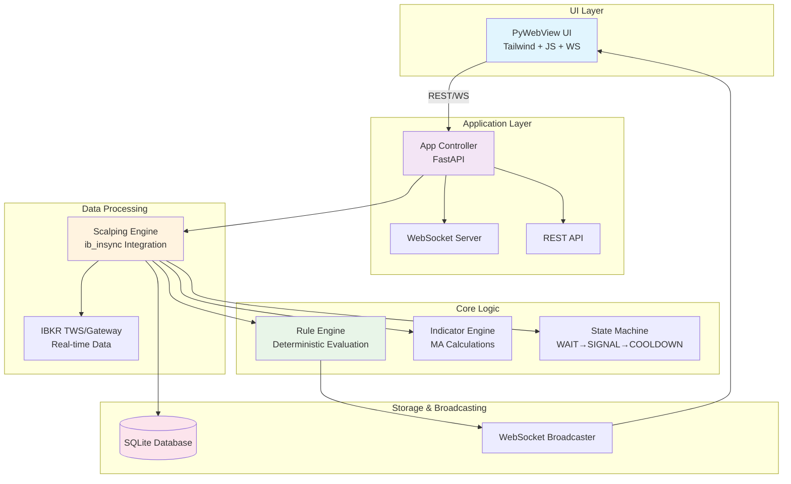
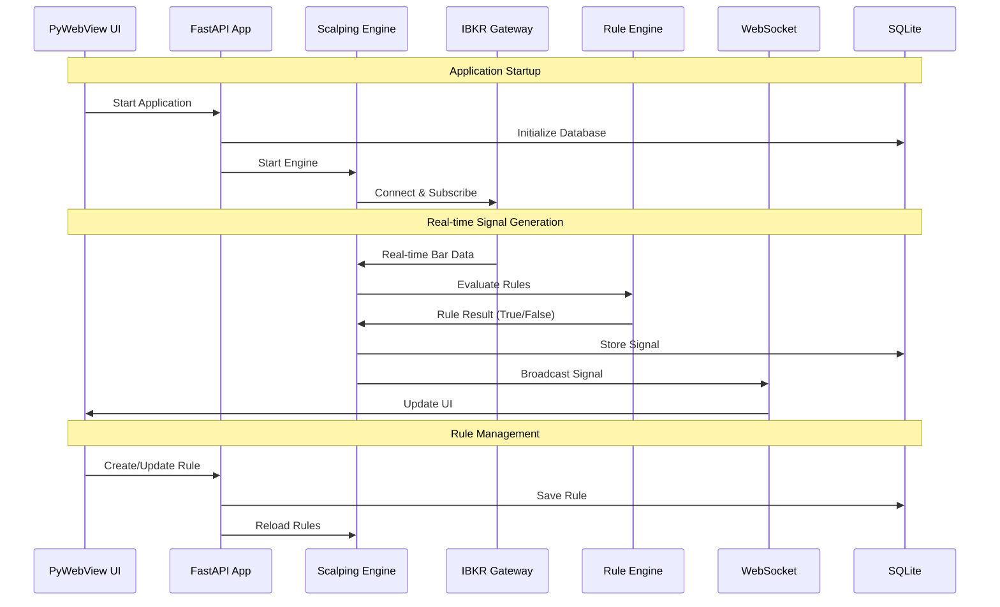
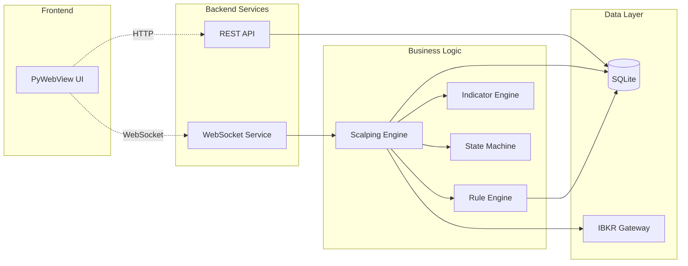

# SignalGen Architecture Diagram

## System Architecture Overview



## Data Flow Diagram



## Component Interaction Map



## Directory Structure Visualization

```mermaid
graph TD
    ROOT[signalgen/]
    
    subgraph "app/"
        APP_DIR[app/]
        
        subgraph "ui/"
            UI_DIR[ui/]
            TEMPLATES[templates/]
            STATIC[static/]
        end
        
        subgraph "core/"
            CORE_DIR[core/]
            RULE_FILE[rule_engine.py]
            IND_FILE[indicator_engine.py]
            STATE_FILE[state_machine.py]
        end
        
        subgraph "engines/"
            ENG_DIR[engines/]
            SCALP_FILE[scalping_engine.py]
        end
        
        subgraph "storage/"
            STOR_DIR[storage/]
            DB_FILE[sqlite_repo.py]
        end
        
        subgraph "ws/"
            WS_DIR[ws/]
            BCAST_FILE[broadcaster.py]
        end
        
        APP_FILE[app.py]
        MAIN_FILE[main.py]
    end
    
    REQ_FILE[requirements.txt]
    README_FILE[README.md]
    GITIGNORE[.gitignore]
    MVP_FILE[PROJECT_MVP.md]
    
    ROOT --> APP_DIR
    ROOT --> REQ_FILE
    ROOT --> README_FILE
    ROOT --> GITIGNORE
    ROOT --> MVP_FILE
    
    APP_DIR --> UI_DIR
    APP_DIR --> CORE_DIR
    APP_DIR --> ENG_DIR
    APP_DIR --> STOR_DIR
    APP_DIR --> WS_DIR
    APP_DIR --> APP_FILE
    APP_DIR --> MAIN_FILE
    
    UI_DIR --> TEMPLATES
    UI_DIR --> STATIC
    
    CORE_DIR --> RULE_FILE
    CORE_DIR --> IND_FILE
    CORE_DIR --> STATE_FILE
    
    ENG_DIR --> SCALP_FILE
    
    STOR_DIR --> DB_FILE
    
    WS_DIR --> BCAST_FILE